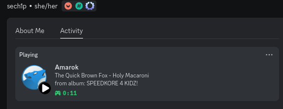

<div style="text-align: center;">
    <h1>🎵 AmarokRichPresence</h1>
</div>
<div style="text-align: center;">
    <p>Simple Discord Rich Presence for Amarok music player.</p>
</div>
<div style="text-align: center;">
    
</div>

## ✨ About

AmarokRichPresence is simple and lightweight Discord *status* for Amarok music player. It was written in Python in about 20 minutes.

I needed an audio player for my computer, I opened the KDE software page and the first item I saw at the top was Amarok, this program looked so cool that I decided to install it.

However, it turned out that it doesn't have Discord integration, and there's also no plugin/script for Discord integration on internet. So I decided to write my own.

## 💾 Requirements

- [Linux distribution](https://en.wikipedia.org/wiki/List_of_Linux_distributions) with [D-Bus](https://en.wikipedia.org/wiki/D-Bus) installed
- [Python 3](https://www.python.org/downloads) (latest version recommended)
- [Amarok 3](https://amarok.kde.org) (this status was written using the latest version of Amarok)

## 💾 Installing

### Binary

Open [releases](https://github.com/sech1p/AmarokRichPresence/releases) page, select `AmarokRichPresence-linux-x64`, download and execute it.

### From source

Open your Terminal and type the commands below:

```sh
$ git clone https://github.com/sech1p/AmarokRichPresence.git
$ cd AmarokRichPresence
$ pip install -r requirements.txt
$ ./AmarokRichPresence
```

🌸 Now you should see Amarok status in your Discord game status, now just turn on some song and enjoy AmarokRichPresence~

## 🗒️ TODO

See [TODO](TODO.md) file.

## 🗒️ License

AmarokRichPresence is licensed under [Apache-2.0](LICENSE) license.
